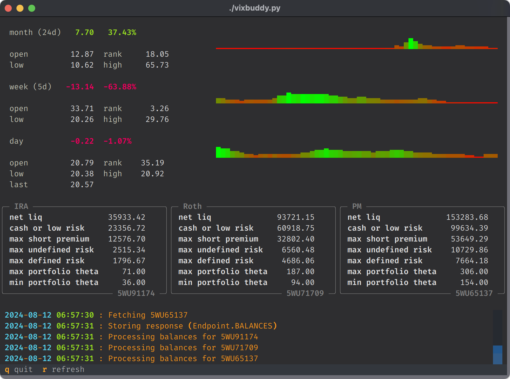

# vixbuddy

  

[Textual](https://textual.textualize.io) TUI for visualizing VIX and it's implications for short-premium portfolio sizing.

## Motivation

- I wanted to be able to see, at a glance, how the VIX has changed over different time periods:
  - **month** (24d) to show the change from 45-DTE to 21-DTE (optimal open and close)
  - **week** for short-term trades
  - **day** for 0-DTE trades
- The current VIX price is used to determine optimal allocations. The math isn't particularly challenging, but it is still unnecessary mental overhead.
- For educational purposes, libraries were avoided for API access.

## Features

- fetch historical/current VIX data
- stats/graphs for changes over past month/week/day
- fetch accounts and balances from [Tastytrade](https://www.tastytrade.com)'s API
- calculate optimal allocations based on current research

## Todo

- use account streamer for live updates (accounts/balances)
- use market streamer for live updates (VIX)
- calculate and show portfolio delta/theta ratio
- show relationships between current and optimal allocations
